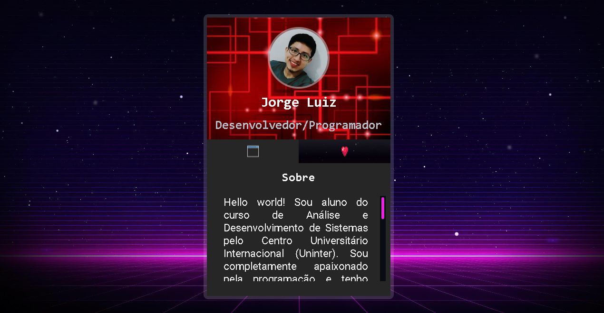

    

## 🖥️ Porjeto
Esse é um projeto mini portfolio que serve para falar um pouco sobre você como, seus gosto, sua carreira profissional e através dele também compartilhar suas redes sociais.

## 🚀 Tecnologias
Esse projeto foi desenvolvido com as seguintes tecnologias como:

- HTML
- CSS
- JavaScript
- Git e Github

